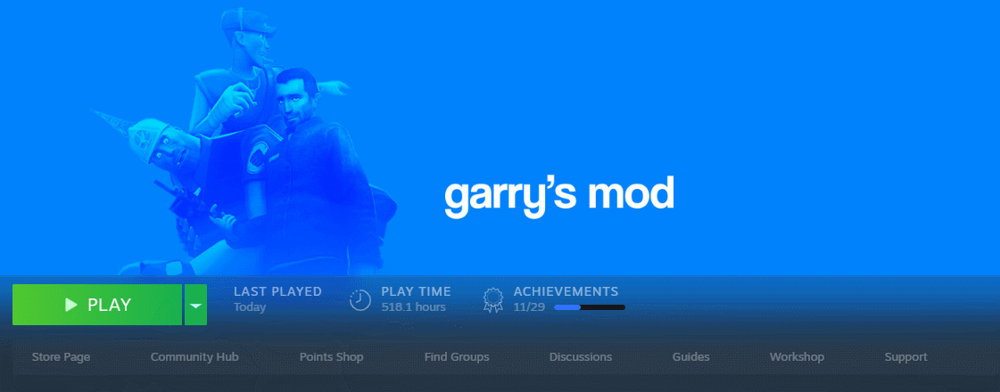

## _Steam Game Path Switch_

- Single file, no install required
- All modifications reset when Steam closes/reopens
- Can be used for
    - game idling (trading cards, hours...)
    - playing with multiple game folders/versions/mods
    - etc
### Usage
- Run through command line and pass full path of exe file
or
- Just double click 

